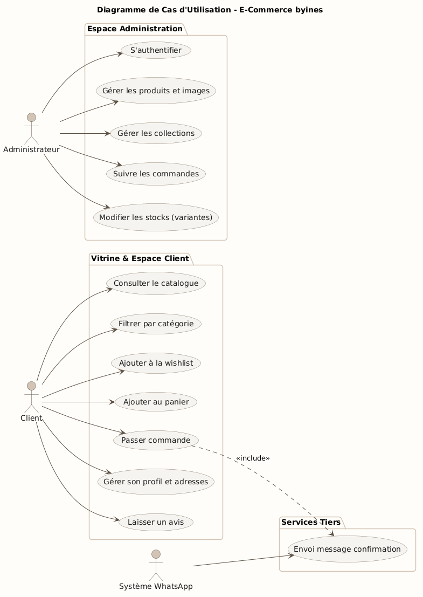
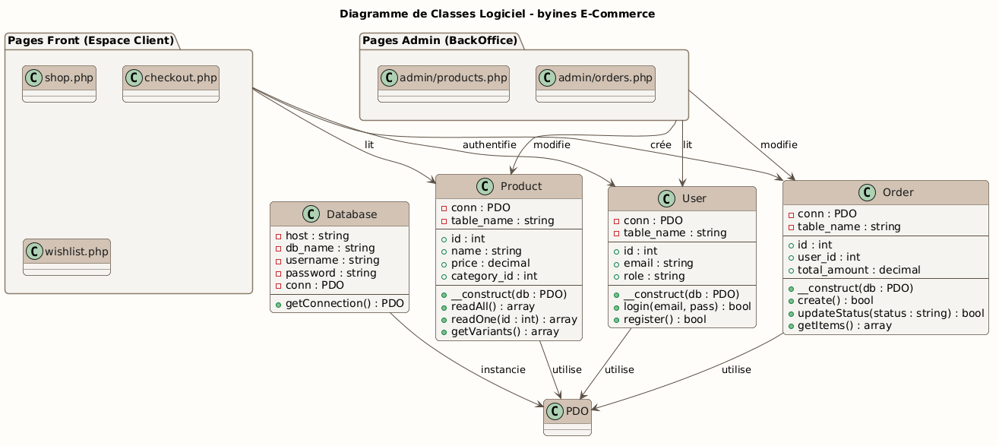
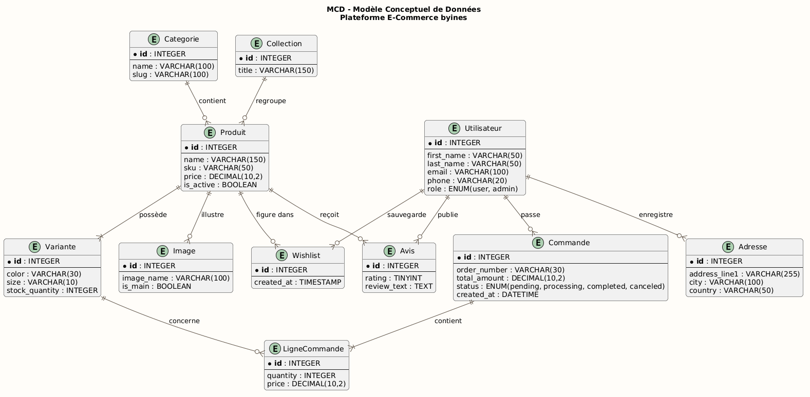
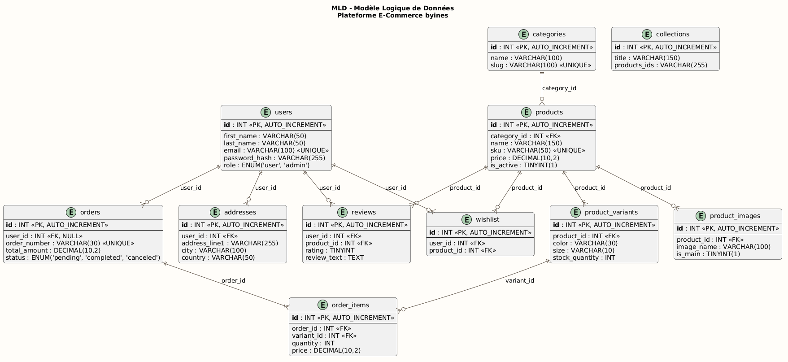
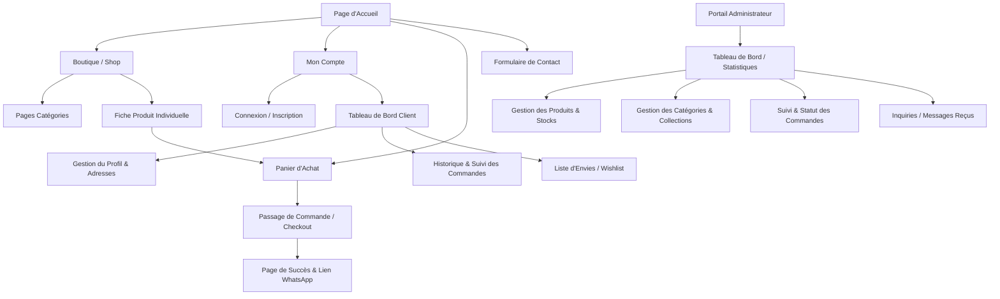

# RAPPORT DE FIN DE FORMATION
## PROJET DE FIN D'ÉTUDES

***

<div align="center">
  <table border="0" width="100%" style="border-collapse: collapse; border: none;">
    <tr style="border: none;">
      <td align="left" width="50%" style="border: none; padding: 10px;">
        
      </td>
      <td align="right" width="50%" style="border: none; padding: 10px;">
        
      </td>
    </tr>
  </table>
  <br/>
  <p><strong>OFFICE DE LA FORMATION PROFESSIONNELLE ET DE LA PROMOTION DU TRAVAIL (OFPPT)</strong></p>
  <p><strong>SOLICODE — ACADÉMIE DE TECHNOLOGIE, TANGER</strong></p>
  <hr width="50%" size="2" color="black"/>
  <br/>
  <br/>
  
  <h1><strong>CONCEPTION ET RÉALISATION D'UNE PLATEFORME E-COMMERCE DE MODE MODESTE ET ISLAMIQUE</strong></h1>
  <h3>Application Web d'E-Commerce Premium pour la Marque « byines »</h3>
  
  <br/>
  <br/>
  <hr width="80%" size="1" color="gray"/>
  <br/>
  
  <p><strong>Réalisé par :</strong></p>
  <h3><strong>Aymane Salmoune</strong></h3>
  
  <br/>
  
  <p><strong>Sous la direction de :</strong></p>
  <h3><strong>M. Youssef Yazidi Alaoui</strong></h3>
  
  <br/>
  <br/>
  <p>Projet de fin d'études présenté en vue de l'obtention du Diplôme de Fin de Formation en Développement Web Full-Stack</p>
  <br/>
  <p><strong>Année Universitaire / Session :</strong> 2025 - 2026</p>
  <p><strong>Établissement :</strong> SoliCode, Tanger (Sous la tutelle de l'OFPPT)</p>
</div>

***

\newpage

## DÉDICACE

*C’est avec une profonde gratitude et un immense amour que je dédie ce modeste travail :*

**À mon enseignant et encadrant, M. Youssef Yazidi Alaoui, ainsi qu'à mon académie SoliCode et l'OFPPT,**
Pour la transmission de votre savoir, votre encadrement rigoureux et bienveillant, et pour l’environnement d'apprentissage d'excellence que vous m'avez offert, me permettant ainsi de concrétiser ce projet professionnel.

**À mes chers parents,**
Aucun mot ne saurait exprimer mon respect, mon affection et ma gratitude pour les sacrifices que vous avez consentis pour mon éducation et mon bien-être. Vos prières et votre soutien inconditionnel ont été ma source d'énergie et de persévérance tout au long de mon parcours académique et personnel. Que Dieu vous accorde santé, longue vie et bonheur.

**À mes chers amis et collègues de SoliCode,**
Avec qui j'ai partagé des moments de complicité, d'entraide et de collaboration inestimables tout au long de cette formation académique.

**À tous mes amis en dehors de l'école,**
Pour vos encouragements constants, votre présence réconfortante et votre soutien moral inconditionnel à chaque étape de cette aventure.

**Aymane Salmoune**

***

\newpage

## REMERCIEMENTS

Avant d'entamer la présentation de ce rapport, je tiens à exprimer mes plus vifs remerciements et ma profonde gratitude à toutes les personnes qui ont contribué de près ou de loin à la réussite de ce projet de fin d'études.

Mes sincères remerciements s'adresse en premier lieu à mon encadrant et formateur, **M. Youssef Yazidi Alaoui**, pour sa disponibilité, ses précieux conseils et son soutien technique et pédagogique tout au long de la période de réalisation de ce projet. Ses orientations avisées ont été déterminantes pour surmonter les difficultés techniques et structurer ce travail.

Je tiens également à exprimer ma gratitude envers la direction et le corps enseignant de l'académie **SoliCode Tanger**, ainsi que de l'**OFPPT**, pour la qualité de la formation qui nous a été dispensée et pour l’environnement d'apprentissage d'excellence qu'ils nous ont offert.

Enfin, je remercie chaleureusement les membres du jury qui ont accepté d'évaluer ce travail et de nous honorer de leur présence lors de la soutenance. Leurs remarques et appréciations permettront sans doute d'enrichir ce projet.

***

\newpage

## SOMMAIRE

* **INTRODUCTION GÉNÉRALE**
* **CHAPITRE I : CAHIER DES CHARGES ET ÉTUDE DE L'EXISTANT**
  * 1.1 Présentation du projet
  * 1.2 Présentation de la problématique
  * 1.3 Solution proposée
  * 1.4 BackOffice (Espace Administration)
* **CHAPITRE II : CONCEPTION DU SYSTÈME**
  * 2.1 Charte graphique et identité visuelle
  * 2.2 Conception et symbolique du logo
  * 2.3 Modélisation UML (Diagramme de cas d'utilisation)
  * 2.4 Modélisation des données (MCD et MLD)
  * 2.5 Arborescence du site web (Website Structure)
* **CHAPITRE III : RÉALISATION TECHNIQUE ET INTERFACES**
  * 3.1 Langages et technologies de développement
  * 3.2 Architecture de l'application
  * 3.3 Structure des fichiers du projet
  * 3.4 Présentation des interfaces utilisateur et administrateur
* **CONCLUSION GÉNÉRALE ET PERSPECTIVES**
* **BIBLIOGRAPHIE / WEBOGRAPHIE**

***

\newpage

## INTRODUCTION GÉNÉRALE

Le commerce électronique connaît aujourd'hui une expansion sans précédent à l'échelle internationale et nationale. Porté par la généralisation de l'accès à Internet et l'évolution des modes de consommation, l'e-commerce est devenu un canal de distribution incontournable pour les entreprises de tous secteurs. Parmi les marchés émergents les plus dynamiques figure celui de la mode modeste (*Modest Fashion*), qui s'adresse à une clientèle féminine recherchant des vêtements à la fois élégants, contemporains et respectueux des principes de pudeur et des traditions islamiques.

Cependant, le secteur de la mode modeste locale reste encore largement dominé par le commerce physique traditionnel ou des canaux informels sur les réseaux sociaux. Ce mode de fonctionnement expose les consommatrices à des contraintes de déplacement, des horaires d'ouverture limités et l'absence de visibilité en temps réel sur la disponibilité des tailles et des couleurs. C'est dans ce contexte que s'inscrit le projet de conception et de réalisation de la plateforme e-commerce **byines**, une application web sur mesure destinée à moderniser l'offre de cette marque et à fluidifier l'expérience d'achat.

Ce rapport retrace les différentes étapes de la conception à la mise en œuvre de cette plateforme. Le premier chapitre sera consacré au cahier des charges, à l'analyse des besoins et à l'étude de l'existant. Le deuxième chapitre détaillera la phase de conception, incluant l'identité visuelle et la modélisation UML et conceptuelle des données. Enfin, le troisième chapitre exposera les choix technologiques et présentera les différentes interfaces développées pour les espaces client et administrateur.

***

\newpage

## CHAPITRE I : CAHIER DES CHARGES ET ÉTUDE DE L'EXISTANT

Dans ce premier chapitre, nous introduisons les fondements théoriques et pratiques de notre projet. Nous définissons le cadre général du projet, exposons la problématique métier à laquelle fait face le marché de la mode modeste et décrivons la solution logicielle conçue pour répondre à ces défis, ainsi que les spécifications de l'espace d'administration.

### 1.1 Présentation du projet
Le projet **byines** consiste en la conception et le développement d'une plateforme e-commerce dynamique *Full-Stack* spécialisée dans la vente en ligne de vêtements modestes et islamiques haut de gamme (Abayas traditionnelles, Kimonos modernes, Niqabs et écharpes/Khimars coordonnés). 

L'objectif principal est de doter la marque d'un showroom virtuel élégant et performant, capable de retranscrire le positionnement premium et artisanal de ses collections.

Les objectifs spécifiques du projet s'articulent autour des axes suivants :
* **Interface Utilisateur Immersive et Responsive (UI/UX) :** Créer une interface visuelle raffinée (inspirée des codes du luxe pudique), fluide et totalement adaptative (*Mobile First*), garantissant une expérience d'achat optimale sur tous les terminaux (smartphones, tablettes, ordinateurs).
* **Catalogue de Produits Structuré :** Concevoir une catégorisation et une fiche produit détaillant avec précision les tissus, les mesures (guide des tailles) et les stocks dynamiques par combinaison de couleur et de taille.
* **Processus d'Achat Sécurisé et Fluide :** Mettre en place un panier sessionnel AJAX et un tunnel de commande (*Checkout*) simplifié pour maximiser le taux de conversion.
* **Canal de Communication Hybride :** Intégrer un système de confirmation de commande via l'API WhatsApp, offrant un contact humain et rassurant pour finaliser les transactions.

### 1.2 Présentation de la problématique
Traditionnellement, les maisons de confection et les boutiques de mode modeste opèrent exclusivement via des points de vente physiques locaux ou, plus récemment, à travers des pages informelles sur les réseaux sociaux (Instagram, Facebook, WhatsApp). Bien que ces méthodes permettent d'initier une activité, elles révèlent rapidement de lourdes limites structurelles :
* **Limites Géographiques et Horaires :** Les consommatrices de mode modeste peinent à trouver des pièces haut de gamme et exclusives près de chez elles. Elles sont soumises aux horaires des boutiques physiques et aux contraintes de déplacement dans les grands centres urbains.
* **Absence de Catalogue Centralisé :** Sur les réseaux sociaux, les articles sont présentés de manière désordonnée. Il n'existe pas de moteur de recherche interne, de filtrage par taille/couleur, ni de système de mise à jour des stocks en temps réel.
* **Traitement Manuel Inefficace :** Les commandes sont passées par messages privés et appels téléphoniques, ce qui entraîne des erreurs de saisie d'adresse, des retards d'expédition, des conflits d'inventaire (survente) et une perte de temps considérable pour l'équipe commerciale.
* **Expérience Client Non Professionnelle :** L'absence d'un espace client structuré empêche le suivi de l'état des colis (en préparation, expédié, livré) et nuit à l'image de marque de la boutique, qui vise un positionnement premium.

### 1.3 Solution proposée
Pour remédier à ces insuffisances, nous avons conçu et réalisé la plateforme e-commerce **byines**. Cette application web dynamique sur mesure élimine les intermédiaires et apporte une réponse technologique complète :
* **Vitrine Virtuelle Permanente :** Un site web accessible 24h/24 et 7j/7 permettant de parcourir l'intégralité des collections de n'importe où, levant ainsi toutes les barrières géographiques.
* **Fiches Produits Interactives :** Présentation enrichie des vêtements avec galeries d'images haute définition spécifiques à chaque couleur, descriptifs de coupe, et sélecteurs de variantes (taille/couleur) avec ajustement dynamique des prix et des disponibilités.
* **Processus d'Achat Intégré :** Automatisation complète du parcours d'achat, du panier au paiement simulé (ou choix du paiement à la livraison), avec génération d'un numéro de commande unique (format `BYINES-[HEX]`) et enregistrement instantané en base de données.
* **Suivi de Commande en Temps Réel :** Un tableau de bord client permettant aux utilisatrices enregistrées de suivre le traitement de leurs colis et de gérer leur carnet d'adresses.

### 1.4 BackOffice « Espace admin »
Le succès d'une plateforme d'e-commerce repose en grande partie sur la simplicité et l'efficacité de sa gestion opérationnelle. C'est pourquoi la plateforme intègre un **BackOffice sécurisé** dédié aux gestionnaires du site. Cet espace d'administration regroupe les fonctionnalités essentielles suivantes :
* **L'ajout de nouveaux articles (vêtements/collections) :** Formulaire complet permettant de renseigner le nom, la description, la référence SKU, le prix de base (et prix promotionnel), la catégorie, d'associer des images de couleur et d'activer/désactiver la visibilité de l'article sur la boutique.
* **La modification des détails des produits (prix, tailles, stocks) :** Interface de gestion des variantes de produit permettant de mettre à jour le stock disponible pour chaque combinaison de taille (S, M, L, XL) et de couleur, et de définir un ajustement de prix (*price modifier*) spécifique à certaines variantes.
* **La suppression d'articles en rupture de stock :** Système de gestion d'inventaire sécurisé empêchant la suppression physique d'un produit déjà lié à des factures ou commandes passées (pour préserver l'intégrité financière) et proposant à la place une désactivation logique (produit inactif).
* **La gestion et le suivi des commandes clients :** Tableau récapitulatif des commandes passées avec filtres par statut (en attente, confirmée, en cours de livraison, livrée, annulée), permettant à l'administrateur de mettre à jour le statut du colis et d'y associer un numéro de suivi d'expédition.
* **La consultation des messages et retours des visiteurs :** Boîte de réception centralisée listant les messages de contact envoyés par le biais du formulaire du site, classés par sujet (renseignement, réclamation, suggestion) avec possibilité de changer leur statut en « lu » ou « archivé ».

***

## CHAPITRE II : CONCEPTION DU SYSTÈME

La phase de conception constitue l'étape intermédiaire essentielle entre l'expression des besoins et le développement informatique. Elle permet d'établir l'identité visuelle de la marque **byines**, de structurer les cas d'utilisation et de concevoir les modèles de données relationnels.

### 2.1 Charte graphique et identité visuelle
Afin de refléter l'élégance de la tradition et le luxe de la mode pudique, la charte graphique de **byines** repose sur un ensemble de variables esthétiques harmonieuses :
* **Palette de Couleurs :**
  * **Crème de Marque (`#F4F1EE`) :** Teinte principale d'arrière-plan, douce et luxueuse, offrant un confort visuel optimal par rapport au blanc brut.
  * **Terre/Sable de Marque (`#D2C3B4`) :** Couleur d'accentuation, utilisée pour les bordures de cartes, les boutons secondaires et les séparateurs visuels.
  * **Sombre de Marque (`#1A1A1A`) :** Teinte dominante pour les textes, la navigation principale, les titres et les boutons d'appel à l'action principaux.
* **Typographie :** L'identité visuelle utilise la police de caractères **« Noto Serif »** comme composante typographique principale (définie dans la variable CSS `--font-serif`). Cette police à empattements insuffle une allure classique et prestigieuse, parfaitement adaptée à l'univers du prêt-à-porter haut de gamme.

### 2.2 Conception et symbolique du logo
Le logo de **byines** a été conçu pour allier minimalisme moderne et artisanat traditionnel. Il se compose d'une typographie manuscrite raffinée affichant le nom de la marque, surmontée d'une icône minimaliste représentant une machine à coudre stylisée. Ce symbole évoque directement le soin apporté à la confection, la précision des coutures et la qualité exclusive des matières premières employées (Nida, Soie de Médine, Crêpe).

> 📸 **EMPLACEMENT IMAGE** — Copiez le logo dans `report/images/logo_byines.png` et remplacez cette ligne par :
> ``

### 2.3 Modélisation UML (Cas d'utilisation et Classes)
Pour structurer les fonctionnalités de notre plateforme, nous avons modélisé les interactions du système et sa structure logicielle.

#### 2.3.1 Diagramme de Cas d'utilisation
Ce diagramme présente les acteurs **Client (Customer)** et **Administrateur (Store Manager)** et leurs actions.

<div style="height: 1000px; width: 100%; position: relative; page-break-inside: avoid; margin: 40px 0;">
  
  <p><em>(Espace réservé : Enregistrez votre image générée sous le nom <strong>usecase_byines.png</strong> dans le dossier <strong>report/images/</strong>)</em></p>
</div>

#### 2.3.2 Diagramme de Classes
Ce diagramme illustre les classes métier (User, Product, Order) et leurs interactions avec la base de données via PDO.

<div style="height: 1000px; width: 100%; position: relative; page-break-inside: avoid; margin: 40px 0;">
  
  <p><em>(Espace réservé : Enregistrez votre image générée sous le nom <strong>class_byines.png</strong> dans le dossier <strong>report/images/</strong>)</em></p>
</div>

### 2.4 Modélisation des données (MCD et MLD)

#### 2.4.1 Modèle Conceptuel de Données (MCD)
Le niveau conceptuel représente le système d'information indépendamment de son aspect informatique, compréhensible par tous. Le diagramme suivant présente les entités et associations :

<div style="height: 1000px; width: 100%; position: relative; page-break-inside: avoid; margin: 40px 0;">
  
  <p><em>(Espace réservé : Enregistrez votre image générée sous le nom <strong>mcd_byines.png</strong> dans le dossier <strong>report/images/</strong>)</em></p>
</div>

#### 2.4.2 Modèle Logique de Données (MLD)
Les entités du modèle conceptuel sont traduites en tables relationnelles avec leurs clés primaires (PK) et étrangères (FK). Le diagramme suivant présente ce modèle logique :

<div style="height: 1000px; width: 100%; position: relative; page-break-inside: avoid; margin: 40px 0;">
  
  <p><em>(Espace réservé : Enregistrez votre image générée sous le nom <strong>mld_byines.png</strong> dans le dossier <strong>report/images/</strong>)</em></p>
</div>


### 2.5 Arborescence du site web (Website Structure)
L'arborescence (ou *Sitemap*) structure les chemins de navigation pour les différents espaces du site. Elle illustre la séparation des espaces d'accès public et des interfaces sécurisées (espace client authentifié et espace d'administration).



***

\newpage

## CHAPITRE III : RÉALISATION TECHNIQUE ET INTERFACES

Ce chapitre expose l'environnement technologique mis en œuvre pour donner vie à la plateforme **byines**, l'architecture logicielle retenue et présente les écrans finaux de l'application.

### 3.1 Langages et technologies de développement
Pour assurer des performances élevées et une totale indépendance vis-à-vis de frameworks lourds, nous avons opté pour un développement natif (*Vanilla*) :
* **Technologies Frontend :** HTML5 pour la structure sémantique, CSS3 (avec variables racines et responsive Flexbox/Grid) pour le design, et JavaScript (ES6 natif) pour le dynamisme (manipulation DOM, requêtes asynchrones AJAX). Bibliothèques externes : **Google Fonts** pour la typographie (Noto Serif) et l'iconographie (**Material Symbols**).
* **Technologie Backend :** **PHP 8.x** natif, structuré selon des principes orientés objet (POO) propres et modulaires.
* **Persistance des Données :** Système de gestion de base de données **MySQL** accédé via l'interface **PDO (PHP Data Objects)**.
* **Environnement Serveur :** Serveur HTTP Apache fourni par le package **XAMPP** sous Windows.
* **Outils de Versioning & Collaboration :** Gestion du code source avec **Git** et hébergement du dépôt sur **GitHub**.

### 3.2 Architecture de l'application
Le projet adopte une structure modulaire inspirée du modèle MVC :
* **Modèles Métier (`/classes`) :** Classes PHP autonomes représentant les entités de notre base de données (ex: `Database.php`, `Product.php`, `Cart.php`, `Order.php`, `User.php`). Ces classes contiennent l'intégralité des requêtes SQL paramétrées (sécurité contre les injections) et de la logique métier.
* **Vues de Présentation (`/pages` et `/includes`) :** Fichiers PHP épurés de requêtes SQL complexes, chargés d'appeler les méthodes des classes et de faire le rendu HTML dynamique. Les parties répétitives (en-tête, pied de page) sont factorisées dans `/includes`.
* **Contrôleurs de Données (`/pages/cart_action.php`, `/pages/process_order.php`) :** Fichiers de traitement AJAX interceptant les requêtes du frontend et renvoyant des réponses structurées au format JSON.

### 3.3 Structure des fichiers du projet

L'arborescence ci-dessous présente l'organisation complète des fichiers sources de la plateforme **byines**, reflétant la séparation claire entre les couches métier, présentation et style.

```
byines/
│
├── index.php                        ← Point d'entrée principal (routeur)
├── setup-database.sql               ← Script DDL de création de la base de données
│
├── classes/                         ← Couche Modèle : logique métier & accès données (PDO)
│   ├── Database.php                 ← Singleton de connexion PDO à MySQL
│   ├── Product.php                  ← Requêtes catalogue, filtres, fiche produit
│   ├── Category.php                 ← Gestion des catégories de vêtements
│   ├── Collection.php               ← Gestion des collections / lookbooks
│   ├── Cart.php                     ← Logique du panier sessionnel
│   ├── Order.php                    ← Création et suivi des commandes
│   └── User.php                     ← Authentification, profil, adresses
│
├── pages/                           ← Couche Vue : pages PHP rendues côté serveur
│   │
│   ├── ── Espace Client ──
│   ├── index.php                    ← Page d'accueil (Hero, catégories, produits populaires)
│   ├── shop.php                     ← Boutique avec filtres (catégorie, prix, taille)
│   ├── product.php                  ← Fiche produit individuelle (galerie, variantes, panier)
│   ├── cart.php                     ← Panier d'achat (résumé, quantités, suppression)
│   ├── checkout.php                 ← Tunnel de commande (adresse, livraison, paiement)
│   ├── order_success.php            ← Page de confirmation & bouton WhatsApp
│   ├── about.php                    ← Page À propos de la marque
│   ├── dashboard.php                ← Espace client (commandes, wishlist, profil)
│   ├── login.php                    ← Connexion utilisateur
│   ├── signup.php                   ← Inscription nouvel utilisateur
│   ├── logout.php                   ← Déconnexion & destruction de session
│   ├── delete_account.php           ← Suppression de compte client
│   │
│   ├── ── Contrôleurs AJAX ──
│   ├── cart_action.php              ← Ajout / suppression / mise à jour panier (JSON)
│   ├── process_order.php            ← Traitement et enregistrement de la commande (JSON)
│   │
│   └── ── BackOffice Administrateur ──
│       ├── admin_dashboard.php      ← Tableau de bord : KPIs de gestion
│       ├── admin_manage_product.php ← CRUD produits & gestion des variantes/stocks
│       ├── admin_manage_category.php← CRUD catégories
│       ├── admin_manage_collection.php ← CRUD collections / lookbooks
│       ├── admin_manage_order.php   ← Mise à jour statut & numéro de suivi commande
│       └── admin_view_order.php     ← Détail complet d'une commande
│
├── includes/                        ← Composants réutilisables (inclus sur chaque page)
│   ├── header.php                   ← Navigation principale, panier mini, session
│   └── footer.php                   ← Pied de page, liens légaux, réseaux sociaux
│
├── css/                             ← Feuilles de style par module
│   ├── style.css                    ← Variables CSS globales (:root), layout général
│   ├── cstyle.css                   ← Styles boutique, cartes produits, filtres
│   ├── product.css                  ← Styles spécifiques à la fiche produit
│   ├── cart-checkout.css            ← Styles panier et tunnel de commande
│   ├── dashboard.css                ← Styles espace client (tableau de bord)
│   ├── admin_dashboard.css          ← Styles BackOffice administrateur
│   ├── login.css                    ← Styles pages connexion / inscription
│   ├── signup.css                   ← Styles formulaire d'inscription
│   └── about.css                    ← Styles page À propos
│
├── scripts/                         ← Modules JavaScript par fonctionnalité
│   ├── header.js                    ← Menu mobile, panier mini (AJAX), notifications
│   ├── product.js                   ← Sélecteur couleur/taille, galerie, ajout panier
│   ├── cart.js                      ← Mise à jour quantités & totaux en temps réel
│   ├── checkout.js                  ← Calcul frais de port dynamique par province
│   ├── dashboard.js                 ← Onglets espace client, wishlist AJAX
│   ├── admin_dashboard.js           ← Gestion stocks inline, interaction UI
│   ├── admin_view_order.js          ← Mise à jour statut commande (AJAX)
│   └── toggle_password.js           ← Affichage/masquage mot de passe
│
├── assets/                          ← Ressources statiques (logos, icônes, images UI)
├── products/                        ← Images des produits uploadées (par SKU/couleur)
├── categories_img/                  ← Visuels des catégories
└── collections_img/                 ← Visuels des collections / lookbooks
```


#### Gestion de la Connexion Unique (Singleton)
La connexion à la base de données est centralisée dans la classe `Database` qui implémente le patron de conception **Singleton**, évitant l'ouverture multiple de connexions SQL lors d'un même script :

```php
class Database {
    private static $instance = null;
    private $conn;
    
    private function __construct() {
        try {
            $this->conn = new PDO("mysql:host=localhost;dbname=byines;charset=utf8mb4", "root", "", [
                PDO::ATTR_ERRMODE => PDO::ERRMODE_EXCEPTION,
                PDO::ATTR_DEFAULT_FETCH_MODE => PDO::FETCH_ASSOC,
                PDO::ATTR_EMULATE_PREPARES => false
            ]);
        } catch (PDOException $e) {
            die("Erreur de connexion SQL.");
        }
    }
    
    public static function getInstance() {
        if (!self::$instance) {
            self::$instance = new self();
        }
        return self::$instance;
    }
    
    public function getConnection() {
        return $this->conn;
    }
}
```

### 3.4 Présentation des interfaces utilisateur et administrateur

#### 3.4.1 Espace Client (Showroom et Achat)

**La Page d'Accueil :**
Présente une bannière principale (*Hero Banner*) mettant en avant la collection saisonnière, suivie d'une grille des catégories d'articles et d'une sélection de produits populaires.

> 📸 **EMPLACEMENT IMAGE** — Faites une capture d'écran de la page d'accueil, sauvegardez-la dans `report/images/screen_accueil.png` et remplacez cette ligne par :
> ``

---

**La Page Boutique (Shop) :**
Propose la liste des articles avec pagination et tri. La colonne de gauche permet de filtrer les articles par catégorie, prix, et tailles.

> 📸 **EMPLACEMENT IMAGE** — Capture de la page boutique avec les filtres visibles → `report/images/screen_shop.png`
> ``

---

**La Fiche Produit :**
Affiche la galerie d'images spécifique à la couleur sélectionnée par l'utilisatrice, la description de la coupe, le prix, et un bouton d'ajout au panier géré de manière asynchrone (sans rechargement de page).

> 📸 **EMPLACEMENT IMAGE** — Capture d'une fiche produit avec la galerie et le sélecteur de variantes → `report/images/screen_product.png`
> ``

---

**Le Panier :**
Le panier liste les articles choisis par la cliente avec la possibilité de modifier les quantités ou de supprimer des articles, et affiche le sous-total mis à jour en temps réel.

> 📸 **EMPLACEMENT IMAGE** — Capture de la page panier → sauvegardez sous `report/images/screen_cart.png` et remplacez cette ligne par :
> ``

---

**Le Checkout (Passage de commande) :**
Le Checkout s'organise en étapes fluides : saisie de l'adresse de livraison, calcul dynamique des frais de port selon la province, choix du mode de paiement, puis confirmation finale de la commande.

> 📸 **EMPLACEMENT IMAGE** — Capture de la page checkout avec le formulaire d'adresse et le récapitulatif → sauvegardez sous `report/images/screen_checkout.png` et remplacez cette ligne par :
> ``


---

**Page de succès & WhatsApp :**
Une fois la commande enregistrée, la cliente accède à un écran récapitulatif avec un bouton d'envoi vers l'API WhatsApp pré-remplissant un message de confirmation (numéro de commande, montant, articles).

> 📸 **EMPLACEMENT IMAGE** — Capture de la page de succès avec le bouton WhatsApp → `report/images/screen_success.png`
> ``

**Espace Client — Tableau de Bord (Dashboard) :**
Une fois authentifiée, la cliente dispose d'un espace personnel complet accessible depuis son compte. Cet espace regroupe l'historique et le suivi de ses commandes (avec statut mis à jour : en attente, expédiée, livrée), sa liste d'envies (*Wishlist*) et la gestion de son profil et carnet d'adresses.

> 📸 **EMPLACEMENT IMAGE** — Capture du tableau de bord client avec les onglets commandes et wishlist visibles → sauvegardez sous `report/images/screen_dashboard.png` et remplacez cette ligne par :
> ``

#### 3.4.2 Espace Administrateur (BackOffice)


**Tableau de Bord :**
Affiche les indicateurs de performance clés (Chiffre d'affaires, total des commandes, nouveaux clients inscrits, messages non lus) pour une vision globale de l'activité.

> 📸 **EMPLACEMENT IMAGE** — Capture du tableau de bord admin avec les KPIs → `report/images/screen_admin_dashboard.png`
> ``

---

**Gestion de l'Administration (Produits & Commandes) :**
L'espace d'administration centralise la gestion complète du catalogue et des commandes sur une seule interface unifiée. L'administrateur peut lister et modifier les articles du catalogue, mettre à jour les stocks pour chaque combinaison de taille et de couleur, configurer les prix et uploader les photos des variantes. Sur la même interface, il peut également suivre l'état des commandes clients, passer le statut de « En attente » à « Expédiée » ou « Livrée », et renseigner le numéro de suivi d'expédition directement depuis le tableau de gestion.

> 📸 **EMPLACEMENT IMAGE** — Capture de l'interface de gestion admin montrant comment chaque article est géré (stocks, variantes, statut commande) → sauvegardez sous `report/images/screen_admin_management_product.png` et remplacez cette ligne par :
> ``

***

***

\newpage

## CHAPITRE IV : TESTS ET VALIDATION

Ce chapitre détaille les phases de tests menées pour s'assurer de la stabilité, de la sécurité et du bon fonctionnement de la plateforme e-commerce avant sa mise en production.

### 4.1 Tests fonctionnels
Nous avons réalisé des tests manuels en parcourant tous les flux utilisateurs principaux de l'application :

| N° | Cas de test | Résultat attendu | Statut |
|---|---|---|---|
| T-01 | Connexion administrateur avec identifiants corrects | Redirection vers tableau de bord | RÉUSSI |
| T-02 | Connexion avec mauvais mot de passe | Message d'erreur affiché | RÉUSSI |
| T-03 | Accès tableau de bord sans connexion | Redirection vers page de connexion | RÉUSSI |
| T-04 | Ajouter un article au panier | L'article apparaît avec la bonne quantité | RÉUSSI |
| T-05 | Modification quantité panier | Total recalculé dynamiquement (AJAX) | RÉUSSI |
| T-06 | Validation de commande (Checkout) | Commande enregistrée, redirection succès | RÉUSSI |
| T-07 | Recherche d'une commande (Admin) | Commande correspondante affichée | RÉUSSI |
| T-08 | Bouton d'alerte WhatsApp | WhatsApp s'ouvre avec message pré-rempli | RÉUSSI |
| T-09 | Ajout d'un produit (BackOffice) | Produit et images enregistrés en base | RÉUSSI |
| T-10 | Gestion des stocks après achat | Stock de la variante décrémenté | RÉUSSI |
| T-11 | Déconnexion de l'espace client/admin | Session effacée, redirection accueil | RÉUSSI |

### 4.2 Tests de sécurité

* **Test Injection SQL :** Les tentatives d'injection dans les formulaires de connexion et de recherche ont été neutralisées avec succès. L'utilisation systématique des requêtes préparées via l'objet PDO (`$stmt->execute()`) empêche l'exécution de code malveillant. **RÉUSSI.**
* **Validation des données :** La soumission de formulaires incomplets ou contenant des données invalides (ex: email incorrect, prix négatif) est bloquée à la fois par le frontend (attributs HTML5) et par le backend (vérifications PHP avant insertion). **RÉUSSI.**
* **Contrôle d'accès :** Les requêtes directes vers des pages d'administration sans session valide sont interceptées et redirigées vers la page de login. **RÉUSSI.**

### 4.3 Tests de responsivité sur mobile

Une vérification de l'adaptabilité (*Responsive Design*) a été effectuée sur différents appareils mobiles et tablettes. Bien que l'interface globale s'ajuste correctement aux écrans tactiles (menus hamburger, grilles de produits adaptatives), le comportement s'est avéré quelque peu instable sur certaines résolutions spécifiques. Des bugs mineurs d'affichage et des chevauchements d'éléments ont été constatés et ne fonctionnent pas encore exactement comme prévu, nécessitant une révision ultérieure des règles CSS (*Media Queries*).

***

\newpage

## CONCLUSION GÉNÉRALE ET PERSPECTIVES

La réalisation de la plateforme e-commerce **byines** a permis de répondre avec précision aux besoins de digitalisation de la marque. En développant une vitrine web moderne, rapide et responsive, couplée à un BackOffice d'administration puissant et à une confirmation hybride par WhatsApp, nous avons conçu un outil opérationnel complet.

Ce projet de fin d'études a constitué une opportunité d'application concrète des compétences acquises à l'académie **SoliCode** sous l'égide de l'**OFPPT**. Il nous a permis de consolider nos acquis en programmation Full-Stack (PHP orienté objet, requêtes préparées PDO, interfaces dynamiques JavaScript/AJAX et conception de bases de données relationnelles).

### Perspectives d'amélioration :
Bien que pleinement opérationnelle dans ses fonctionnalités principales, la plateforme **byines** intègre un ensemble de fonctionnalités identifiées comme axes d'évolution prioritaires pour ses prochaines versions :

1. **Système de Promotions et Soldes :** Mettre en place un module de gestion des ventes flash et des remises, permettant à l'administrateur de définir des périodes de soldes, des codes promo et des réductions automatiques par catégorie ou produit.

2. **Newsletter et Marketing Email :** Intégrer un système d'inscription à la newsletter permettant de collecter les adresses email des visiteurs et de leur envoyer des campagnes automatisées (nouvelles collections, promotions, relances de panier abandonné).

3. **Filtrage par Taille :** Ajouter un filtre de taille (S, M, L, XL) directement sur la page boutique, permettant aux clientes de n'afficher que les articles disponibles dans leur taille, en se basant sur le stock réel des variantes en base de données.

4. **Tableau de Bord Client Enrichi :** Améliorer l'espace client pour inclure des statistiques personnelles (total des commandes, montant cumulé dépensé, articles favoris), un suivi de livraison cartographique et un système de points de fidélité.

5. **Barre de Recherche Globale :** Implémenter une barre de recherche en temps réel (via AJAX) permettant de retrouver instantanément des articles par nom, description, couleur ou catégorie, avec autocomplétion des suggestions.

6. **Système d'Avis et de Notations :** Activer le module de commentaires et de notations clients (table `reviews` déjà présente en base de données) avec un système de modération depuis le BackOffice avant publication, et affichage de la note moyenne sur les fiches produits.

7. **Wishlist Persistante et Partageable :** Améliorer la liste d'envies pour qu'elle soit accessible sans connexion (stockage local), synchronisée sur tous les appareils après authentification, et partageable via un lien unique sur les réseaux sociaux.

8. **Passerelle de Paiement en Ligne :** Remplacer le système simulé de paiement à la livraison par l'intégration d'une API de paiement sécurisée adaptée au marché marocain (CMI — Centre Monétique Interbancaire) ainsi que des solutions internationales (Stripe, PayPal).

9. **Optimisation SEO :** Améliorer le référencement naturel de la plateforme en générant des balises `<meta>` dynamiques par produit et catégorie, des URLs canoniques, des sitemaps XML automatiques et des données structurées (Schema.org) pour les fiches produits.

10. **Notifications Automatiques (Email & WhatsApp) :** Mettre en place un système de notifications bi-canal : envoi automatique d'emails transactionnels (confirmation de commande, mise à jour de statut d'expédition) via PHPMailer, couplé à des messages WhatsApp automatisés via l'API officielle WhatsApp Business Cloud.

***

\newpage

## BIBLIOGRAPHIE / WEBOGRAPHIE

1. **PHP Documentation Officielle :** Références des fonctions et de l'architecture POO. URL : [https://www.php.net/](https://www.php.net/)
2. **Documentation MySQL Reference Manual :** Structuration des requêtes et gestion des transactions ACID. URL : [https://dev.mysql.com/doc/](https://dev.mysql.com/doc/)
3. **MDN Web Docs (Mozilla Developer Network) :** Spécifications du langage JavaScript moderne (ES6+), des requêtes Fetch/AJAX et de la mise en page CSS Grid/Flexbox. URL : [https://developer.mozilla.org/](https://developer.mozilla.org/)
4. **Google Fonts & Material Symbols :** Typographie et banque d'icônes vectorielles. URL : [https://fonts.google.com/](https://fonts.google.com/)
5. **Codebase du Projet byines :** DDL MySQL et scripts d'implémentation de la boutique.

***


