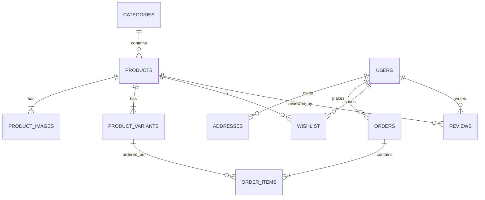
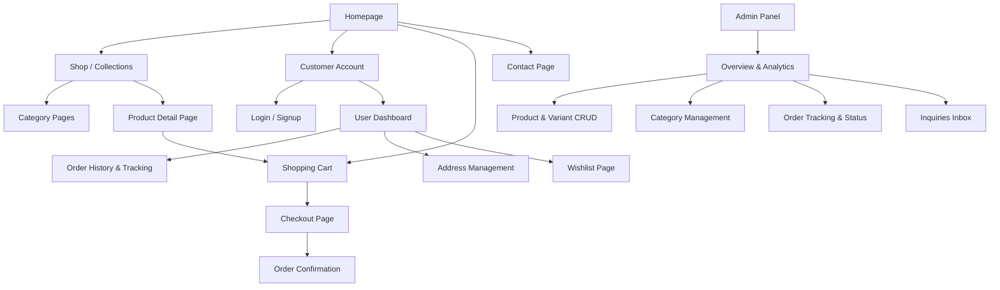

# Graduation Project Report
## ByInes E-Commerce Platform
*Design and Development of a Premium E-Commerce Platform Specialized in Traditional Modest Wear*

**Academic Year**: 2025 – 2026  
**Author**: [Student First & Last Name]  
**Advisor**: [Advisor First & Last Name]  
**Academic Department**: [Department/Major Name]

---

## Acknowledgments

I would like to express my deepest gratitude to my advisor, [Advisor Name], for their guidance, valuable advice, availability, and patience throughout this project. Their insights and direction were crucial in completing this work.

I would also like to thank the jury members for reviewing and evaluating this project, and the entire educational staff at our institution for the quality of the education provided during my academic career.

Finally, I dedicate this work to my family, especially my parents, for their unconditional support, encouragement, and sacrifices which have allowed me to pursue my studies in the best conditions.

---

## Table of Contents
1. [General Introduction](#general-introduction)
2. [Chapter 1: Project Context](#chapter-1-project-context)
   - 1.1 Host Company Presentation
   - 1.2 Project Presentation and Objectives
     - 1.2.1 Main Objective
     - 1.2.2 Specific Objectives
     - 1.2.3 Project Scope
3. [Chapter 2: General Study of the Project](#chapter-2-general-study-of-the-project)
   - 2.1 Project Context and Needs Analysis
   - 2.2 Problem Statement
   - 2.3 Proposed Solution
   - 2.4 Functional Requirements
     - 2.4.1 Client Space
     - 2.4.2 Administrator Space
   - 2.5 Non-Functional Requirements
   - 2.6 Work Methodology
4. [Chapter 3: Analysis and Design](#chapter-3-analysis-and-design)
   - 3.1 Use Case Diagram (UML)
   - 3.2 Conceptual Data Model (ERD)
   - 3.3 Logical Data Model (Relational Schema)
     - 3.3.1 Relational Schema
     - 3.3.2 Technical Data Dictionary
   - 3.4 Visual Identity
     - 3.4.1 Typography
     - 3.4.2 Color Palette
   - 3.5 Website Sitemap
   - 3.6 Wireframes and Mockups
5. [Chapter 4: Technical Implementation](#chapter-4-technical-implementation)
   - 4.1 Choice of Technologies
   - 4.2 Project Architecture & File Structure
     - 4.2.1 File Organization
     - 4.2.2 Database Connection
     - 4.2.3 Session Management
   - 4.3 Functional Modules
     - 4.3.1 Authentication & Registration
     - 4.3.2 Product Catalog & Detail Sheet
     - 4.3.3 Category & Collections Management
     - 4.3.4 Order Processing & Checkout Flow
     - 4.3.5 WhatsApp Order Confirmation
     - 4.3.6 Wishlist & Search Systems
     - 4.3.7 Administrator Dashboard & Statistics
     - 4.3.8 SEO and GEO Optimization
6. [Chapter 5: Technical Difficulties and Solutions](#chapter-5-technical-difficulties-and-solutions)
   - 5.1 Responsive Web Design Challenges
   - 5.2 Database Atomicity and Transaction Control
   - 5.3 Stock Concurrency Issues
   - 5.4 Asynchronous State Management (AJAX)
7. [Chapter 6: Conclusion and Future Prospects](#chapter-6-conclusion-and-future-prospects)
   - 6.1 Project Evaluation
   - 6.2 Future Enhancements
     - 6.2.1 CSRF Protection
     - 6.2.2 Online Payment Gateway Integration
     - 6.2.3 Automatic Email Notifications
     - 6.2.4 Advanced User Analytics
     - 6.2.5 Mobile Application / PWA
     - 6.2.6 Customer Loyalty Program
     - 6.2.7 Product Reviews Moderation

---

## General Introduction

In a global context where e-commerce is experiencing exponential growth, the modest fashion sector has emerged as one of the most dynamic and promising markets. Traditional abayas, representing elegance and modesty, constitute a rapidly expanding market that requires modern digital solutions to meet the demands of a highly connected and demanding clientele.

This report documents the design and development of **ByInes**, a custom-built, premium e-commerce platform dedicated to traditional luxury abayas. This project aims to digitize and modernize a high-end physical boutique's commercial operations while preserving the authenticity, craftsmanship, and elegant presentation characterizing its products.

This report is structured into six chapters. Chapter 1 introduces the project context. Chapter 2 details the requirement analysis, problem statement, and methodology. Chapter 3 focuses on analysis and system design, displaying the conceptual models. Chapter 4 explains the technical implementation, technology stack, and module architectures. Chapter 5 discusses the technical challenges encountered and how they were solved. Finally, Chapter 6 presents a project review and future perspectives.

---

## Chapter 1: Project Context

### 1.1 Host Company Presentation
The project was developed in partnership with **ByInes**, a luxury modest fashion boutique specializing in high-end traditional abayas. While the brand enjoys a solid reputation in physical retail, it lacked a professional digital sales channel to reach customers beyond its immediate geographical area.

The brand positions itself in the accessible luxury segment of modest fashion under the tagline *"Timeless Elegance"*. Its product range includes:
* **Casual Abayas** for daily wear.
* **Evening Abayas** featuring delicate embroidery and beadwork.
* **Occasion/Ceremony Abayas** for formal events.
* **Khimars, Scarves, and Matching Sets** to complement the outfits.

Premium materials such as Nida, Medina silk, crepe, and velvet are carefully selected to guarantee quality, comfort, and style. High emphasis is placed on preserving the artisanal craftsmanship of abaya tailoring, which constitutes a major brand differentiator.

Previously, the boutique's digital presence was restricted to informal social media accounts (Instagram, WhatsApp). These channels lacked a structured shopping cart, secure checkout, inventory control, or order tracking, creating operational bottlenecks and limiting business expansion.

### 1.2 Project Presentation and Objectives

#### 1.2.1 Main Objective
The primary objective of this project is to design and develop a custom, responsive, and secure e-commerce platform that showcases the boutique's luxury collections, delivers an intuitive shopping experience, and provides a backend system for administrative operations.

#### 1.2.2 Specific Objectives
* **Structured Product Catalog**: Enable customers to navigate categories, apply filters, and view detailed product sheets containing high-definition galleries, fabric descriptions, and sizing guides.
* **Shopping Cart and Order Workflow**: Provide a session-based shopping cart and a frictionless multi-step checkout process.
* **Premium UI/UX Design**: Create a minimalist, elegant, and mobile-first visual interface reflecting the premium identity of the brand.
* **Performance and Responsiveness**: Guarantee fast page load speeds and smooth navigation across desktop, tablet, and mobile devices.
* **Operational Admin Panel**: Empower administrators to manage products, categories, collections, and orders, and view key sales analytics.

#### 1.2.3 Project Scope
The scope covers both customer-facing (frontend) and store management (backend) capabilities. The front end supports registration, product search, cart manipulation, checkout, order history tracking, and contact forms. The back end provides inventory management, category editing, order processing, customer records management, and real-time dashboard analytics.

---

## Chapter 2: General Study of the Project

### 2.1 Project Context and Needs Analysis
An analysis of existing modest fashion retailers reveals a lack of custom-tailored websites for boutique brands. Many rely on generic templates that fail to convey a luxury aesthetic. 

Operationally, manual ordering via messaging apps is prone to errors, delays in delivery, and poor customer retention. Customers have no interactive tools to check product stock in real time, choose exact sizes and colors, or view delivery progress. The boutique's management also lacks centralized dashboards to track revenue, manage stock levels, and coordinate order fulfillment.

### 2.2 Problem Statement
The central problem of this project is formulated as follows:
> *How can we design and develop a high-performing, user-friendly, custom e-commerce platform tailored to the luxury abaya market that delivers a premium client experience while providing administrators with efficient business management tools?*

Sub-questions include:
1. How can we organize the architecture to ensure scalability and maintainability without relying on heavy frameworks?
2. What database structures are required to support complex multi-variant products (multiple size and color combinations with individual stock levels)?
3. How can we maintain visual excellence and responsiveness using vanilla CSS?
4. How can we integrate local purchasing habits (e.g., Cash on Delivery, shipping costs, and WhatsApp notifications) into a standard e-commerce flow?

### 2.3 Proposed Solution
The proposed solution is a custom-designed, lightweight e-commerce platform built on a vanilla PHP/MySQL/JavaScript stack. The application avoids the overhead of monolithic frameworks to achieve maximum load performance, utilizing an object-oriented, MVC-inspired architecture.

The platform is split into two secure areas:
1. **Public Client Space**: Focused on discovery, visual presentation, and seamless checkout.
2. **Secure Admin Space**: Focused on inventory control, order dispatching, and sales analysis.
3. **WhatsApp Integration**: A hybrid checkout feature that auto-generates structured order confirmations and allows customers to ping the store directly via WhatsApp, combining digital efficiency with personal customer service.

### 2.4 Functional Requirements

#### 2.4.1 Client Space
* **Authentication**: Secure registration, login, session persistence, and password management.
* **Catalog Browsing**: Categories grid, filtering by price range, color, size, and sorting (by price, date, popularity).
* **Detailed Product Sheets**: Image carousels, size/color selectors, dynamic stock checking, detailed specifications, and review displays.
* **Session Cart**: Real-time item count, price calculations, and item adjustments without page reloads.
* **Multi-Step Checkout**: Shipping address details (focused on Moroccan provinces), shipping cost estimation (free for Tangier, flat rate for other cities), cash-on-delivery or PayPal payment choice, and unique order number generation.
* **Customer Dashboard**: Order history, order status tracking (Pending, Processing, In Transit, Delivered, Cancelled), profile updating, and account deletion.
* **Wishlist**: Save favorite items to a personal wishlist.
* **Contact & Inquiry**: Contact form with subject selection and text submission.

#### 2.4.2 Administrator Space
* **Overview Dashboard**: Graphical and textual KPIs (total sales, orders, users, low stock warnings).
* **Product CRUD**: Add, edit, and disable products; upload multiple high-definition photos; tag images by color; define sizes, quantities, and price modifiers.
* **Category & Collection CRUD**: Categorize products and create custom collections (e.g., "Ramadan Collection", "Summer Specials").
* **Order Management**: Filter orders by status, view detailed order sheets, edit shipping addresses, insert tracking numbers, and modify order status.
* **User Accounts & Messages**: View client lists, disable accounts if needed, and respond to contact inquiries.

### 2.5 Non-Functional Requirements
* **Performance**: Pages must load under 3 seconds under normal network conditions.
* **Security**: All SQL statements must use parameterized prepared statements to prevent SQL Injection. Passwords must be hashed using `bcrypt` (via `password_hash`). Session hijacking must be prevented, and sensitive admin routes must enforce role validation.
* **Responsiveness**: The site must adjust to mobile, tablet, and desktop viewports, using a mobile-first philosophy.
* **Browser Compatibility**: Full functional compatibility with Google Chrome, Mozilla Firefox, Safari, and Microsoft Edge.
* **SEO Optimization**: Clean semantic HTML, meta descriptions, unique page titles, descriptive slugs, and image alt tags.

### 2.6 Work Methodology
The project followed an agile-inspired, iterative development schedule divided into three main phases:
1. **Analysis and Design (3 Weeks)**: Focus on requirement gathering, database entity relationship design (ERD), wireframing, and Figma prototyping.
2. **Development Phase (4 Weeks)**: 
   - *Weeks 4–5*: Backend architecture (database, singleton connection, OOP classes, session management).
   - *Weeks 6–7*: Frontend templates integration, AJAX operations, responsiveness, and administrator dashboard.
3. **Testing and Validation (1 Week)**: Unit tests, SQL transaction tests, user acceptance testing (UAT), page speed optimization, and final deployment adjustments.

---

## Chapter 3: Analysis and Design

### 3.1 Use Case Diagram (UML)
The system involves two main actors: the **Customer (Client)** and the **Administrator**.

```mermaid
usecaseDiagram
    actor Customer as "Customer (Client)"
    actor Admin as "Store Administrator"

    rectangle "ByInes Platform" {
        Customer --> (Browse Catalog)
        Customer --> (Register & Login)
        Customer --> (Manage Profile & Addresses)
        Customer --> (Add to Wishlist)
        Customer --> (Add to Cart & Checkout)
        Customer --> (Track Order Status)
        Customer --> (Submit Reviews)
        Customer --> (Send Contact Message)

        (Add to Cart & Checkout) ..> (WhatsApp Confirmation) : <<extends>>

        Admin --> (Manage Products & Variants)
        Admin --> (Manage Categories & Collections)
        Admin --> (Manage Orders & Status)
        Admin --> (View Sales Analytics)
        Admin --> (Manage Client Accounts)
        Admin --> (Moderate Product Reviews)
    }
```

### 3.2 Conceptual Data Model (ERD)
The database structure establishes clear relationships between users, products, categories, orders, variants, and customer feedback.



### 3.3 Logical Data Model (Relational Schema)

#### 3.3.1 Relational Schema
Based on the actual project database implementation, the tables are defined as follows:

1. **`users`** (`id` [PK], `first_name`, `last_name`, `email` [UNIQUE], `phone`, `password_hash`, `role` [ENUM], `created_at`, `updated_at`)
2. **`categories`** (`id` [PK], `name`, `slug` [UNIQUE], `image_url`)
3. **`products`** (`id` [PK], `category_id` [FK], `name`, `slug` [UNIQUE], `sku` [UNIQUE], `description`, `price`, `old_price`, `is_active`, `created_at`)
4. **`product_images`** (`id` [PK], `product_id` [FK], `color`, `image_name`, `sort_order`, `is_main`)
5. **`product_variants`** (`id` [PK], `product_id` [FK], `color`, `size`, `stock_quantity`, `price_modifier`, *composite unique* [`product_id`, `color`, `size`])
6. **`addresses`** (`id` [PK], `user_id` [FK], `address_type`, `is_primary`, `first_name`, `last_name`, `phone`, `address_line1`, `address_line2`, `city`, `state`, `zip_code`, `country`)
7. **`orders`** (`id` [PK], `user_id` [FK, NULL], `order_number` [UNIQUE], `subtotal`, `tax`, `shipping_cost`, `total_amount`, `status` [ENUM], `tracking_number`, `shipping_name`, `shipping_phone`, `shipping_address_line1`, `shipping_address_line2`, `shipping_city`, `shipping_state`, `shipping_zip`, `shipping_country`, `shipping_method`, `payment_method` [ENUM], `payment_status` [ENUM], `payment_transaction_id`, `created_at`)
8. **`order_items`** (`id` [PK], `order_id` [FK], `variant_id` [FK], `quantity`, `price`)
9. **`wishlist`** (`id` [PK], `user_id` [FK], `product_id` [FK], `created_at`, *composite unique* [`user_id`, `product_id`])
10. **`reviews`** (`id` [PK], `product_id` [FK], `user_id` [FK], `rating`, `review_text`, `is_approved`, `created_at`, *composite unique* [`product_id`, `user_id`])

*(Note: The `collections` table stores custom collections: `id` [PK], `title`, `image_url`, `product_ids` [CSV string])*

---

#### 3.3.2 Technical Data Dictionary

##### Table: `users`
| Column | Type | Nullable | Key | Default | Description |
| :--- | :--- | :---: | :---: | :--- | :--- |
| `id` | INT | NO | PK | *Auto Increment* | Unique user identifier |
| `first_name` | VARCHAR(50) | NO | | | User's first name |
| `last_name` | VARCHAR(50) | NO | | | User's last name |
| `email` | VARCHAR(100) | NO | UNIQUE | | Unique email (username) |
| `phone` | VARCHAR(20) | YES | | NULL | Phone number |
| `password_hash` | VARCHAR(255) | NO | | | bcrypt password hash |
| `role` | ENUM('user', 'admin') | NO | | 'user' | Access permissions level |
| `created_at` | TIMESTAMP | NO | | CURRENT_TIMESTAMP | Date account created |
| `updated_at` | TIMESTAMP | NO | | CURRENT_TIMESTAMP | Date account modified |

##### Table: `products`
| Column | Type | Nullable | Key | Default | Description |
| :--- | :--- | :---: | :---: | :--- | :--- |
| `id` | INT | NO | PK | *Auto Increment* | Unique product identifier |
| `category_id` | INT | NO | FK | | Linked category reference |
| `name` | VARCHAR(150) | NO | | | Product name |
| `slug` | VARCHAR(150) | NO | UNIQUE | | URL-friendly name |
| `sku` | VARCHAR(50) | NO | UNIQUE | | Stock Keeping Unit |
| `description` | TEXT | NO | | | Product description |
| `price` | DECIMAL(10,2) | NO | | | Regular price |
| `old_price` | DECIMAL(10,2) | YES | | NULL | Compare-at/sale price |
| `is_active` | TINYINT(1) | NO | | 1 | Visibility (0=hidden, 1=visible) |
| `created_at` | TIMESTAMP | NO | | CURRENT_TIMESTAMP | Registration date |

##### Table: `product_variants`
| Column | Type | Nullable | Key | Default | Description |
| :--- | :--- | :---: | :---: | :--- | :--- |
| `id` | INT | NO | PK | *Auto Increment* | Unique variant identifier |
| `product_id` | INT | NO | FK | | Parent product ID |
| `color` | VARCHAR(30) | NO | | | Color attribute |
| `size` | VARCHAR(10) | NO | | | Size attribute (S, M, L, XL, etc.) |
| `stock_quantity`| INT | NO | | 0 | Available inventory |
| `price_modifier`| DECIMAL(10,2) | NO | | 0.00 | Added/subtracted variant cost |

##### Table: `orders`
| Column | Type | Nullable | Key | Default | Description |
| :--- | :--- | :---: | :---: | :--- | :--- |
| `id` | INT | NO | PK | *Auto Increment* | Unique order identifier |
| `user_id` | INT | YES | FK | NULL | Purchasing client ID |
| `order_number` | VARCHAR(30) | NO | UNIQUE | | Format: BYINES-[HEX_STRING] |
| `subtotal` | DECIMAL(10,2) | NO | | | Sum of item prices |
| `tax` | DECIMAL(10,2) | NO | | | Flat 10% tax rate |
| `shipping_cost` | DECIMAL(10,2) | NO | | | Tangier = $0, Rest of Morocco = $3 |
| `total_amount` | DECIMAL(10,2) | NO | | | Subtotal + Tax + Shipping |
| `status` | ENUM | NO | | 'pending' | pending/processing/in_transit/delivered |
| `payment_method`| ENUM | NO | | | cash_on_delivery/paypal/credit_card |
| `payment_status`| ENUM | NO | | 'unpaid' | unpaid/paid/refunded/failed |

---

### 3.4 Visual Identity

#### 3.4.1 Typography
The typography system relies on a curated set of variables defined in the stylesheet:
* **Brand Font**: `"Noto Serif", serif` (defined as `--font-serif`). It serves as the primary font for the body copy, headers, navigation elements, and brand titles, conveying classic elegance, prestige, and readability.
* **Icons**: `Material Symbols` and `Font Awesome v6.x` are used for iconography (search drawer, cart, favorites, account toggles).

#### 3.4.2 Color Palette
The ByInes design system uses an earth-toned, minimalist color scheme:
* **Cream Accent (`--brand-cream: #F4F1EE`)**: The primary background color of the web pages, providing a soft, luxurious feel.
* **Sand / Earth Border (`--brand-earth: #D2C3B4`)**: Used for product cards, containers, secondary borders, and visual card overlays.
* **Charcoal Dark (`--brand-dark: #1A1A1A`)**: Used as the primary color for body typography, main menu headers, action buttons (CTAs), and navigation links.
* **Neutral Whites & Grays**: `--white` (`#ffffff`) for cards/dropdown contents; `--gray-100` (`#f3f4f6`) to `--gray-500` (`#6b7280`) for borders, form fields, and secondary meta details.

### 3.5 Website Sitemap



### 3.6 Wireframes and Mockups
The sitemap layouts were prototyped in Figma using a mobile-first viewport design. Standardizing layout elements (header, search drawer, shopping cart sidebar, responsive grids) ensured layout consistency before coding began.

---

## Chapter 5: Technical Implementation

### 4.1 Choice of Technologies
* **Frontend**: Vanilla HTML5 for semantics; modular CSS3 (CSS Custom Variables, Flexbox, Grid layouts) for design styling; Vanilla ES6+ JavaScript for DOM manipulation and asynchronous AJAX requests. Libraries: **Chart.js** (for dashboard reports) and **Font Awesome** (for high-fidelity icons).
* **Backend**: **PHP 8.x** running procedural and OOP routing (no heavy external framework).
* **Database & Server**: **MySQL / MariaDB** accessed via PHP Data Objects (PDO) with parameterization. Executed on **Apache HTTP Server** (via XAMPP).
* **Version Control**: Git / GitHub.

### 4.2 Project Architecture & File Structure

#### 4.2.1 File Organization
The project directory is structured to separate concerns:
```
byines/
├── index.php                        # Redirects to pages/index.php
├── setup-database.sql               # Database DDL & seeds
├── classes/                         # OOP Business Logic / Models
│   ├── Database.php                 # Database Connection (Singleton)
│   ├── User.php                     # Customer/Admin authentication & operations
│   ├── Product.php                  # Product listing, variants, reviews
│   ├── Category.php                 # Categories management
│   ├── Cart.php                     # Shopping cart helper
│   └── Order.php                    # Invoice creation, shipping, updates
├── includes/                        # Reusable view components
│   ├── header.php                   # Autoloader, Navbar, cart badge
│   └── footer.php                   # Footer links, newsletter
├── pages/                           # Client-facing routing
│   ├── index.php                    # Homepage view
│   ├── shop.php                     # Listings with filters
│   ├── product.php                  # Product details page
│   ├── cart.php                     # Cart manager page
│   ├── checkout.php                 # Checkout form page
│   ├── process_order.php            # AJAX order compiler
│   ├── admin_dashboard.php          # Admin portal
│   └── ... (auth/dashboard pages)
├── css/                             # Component-specific styles
│   ├── style.css                    # Global themes & layout variables
│   ├── product.css / cart-checkout.css
│   └── ...
└── scripts/                         # Client-side JavaScript
    ├── cart.js / product.js / admin.js
```

#### 4.2.2 Database Connection
Database access is handled through a thread-safe singleton connection class (`classes/Database.php`), wrapping PDO in a private constructor.

```php
class Database {
    private static $instance = null;
    private $conn;
    
    private function __construct() {
        $host = "localhost";
        $db = "byines";
        $user = "root";
        $pass = "";
        
        try {
            $this->conn = new PDO("mysql:host=$host;dbname=$db;charset=utf8mb4", $user, $pass, [
                PDO::ATTR_ERRMODE => PDO::ERRMODE_EXCEPTION,
                PDO::ATTR_DEFAULT_FETCH_MODE => PDO::FETCH_ASSOC,
                PDO::ATTR_EMULATE_PREPARES => false
            ]);
        } catch (PDOException $e) {
            die("Database connection failed.");
        }
    }
    
    public static function getInstance() {
        if (!self::$instance) {
            self::$instance = new self();
        }
        return self::$instance;
    }
    
    public function getConnection() {
        return $this->conn;
    }
}
```

#### 4.2.3 Session Management
User validation utilizes native PHP sessions (`session_start()`). Upon login, variables `user_id`, `user_name`, and `user_role` are registered in `$_SESSION`. Sensitive administrator views include check validations that redirect non-admin accounts back to the login page.

---

### 4.3 Functional Modules

#### 4.3.1 Authentication & Registration
When registering, user data is validated both client-side and server-side. The email address uniqueness is verified, and the password is encrypted using `password_hash($pwd, PASSWORD_DEFAULT)` using a default cost of 10. To prevent user enumeration attacks, login errors display a generic "Invalid credentials" error.

#### 4.3.2 Product Catalog & Detail Sheet
The Catalog fetches active records from `products`, performing an inner join on `categories`. It includes pagination (12 items per page) and URL sorting parameters.

The Detailed Product Sheet fetches specific variants based on user selection. It checks stock level via `product_variants` and pulls color-specific images using the `Product::getImageByColor()` method.

#### 4.3.3 Category & Collections Management
Categories represent standard groupings (Abayas, Kimonos, Scarves, Niqabs). Custom collections (like "Summer Specials") are managed in the admin backend. Product records are linked via the `collections` table, facilitating dynamic landing page grids.

#### 4.3.4 Order Processing & Checkout Flow
Checkout uses a secure AJAX pipeline (`pages/process_order.php`). It queries the `Cart` session data, calculates tax (flat 10%), shipping (free for Tangier, $3 elsewhere), verifies variant stock levels, and inserts the record inside the database using PDO transactions. It assigns a unique order number using the format `BYINES-[HEX]`.

#### 4.3.5 WhatsApp Order Confirmation
After order insertion, the customer is presented with an "Order Success" page that contains a CTA button to confirm the order via WhatsApp. Clicking the button redirects the user to the WhatsApp Web/App API (`wa.me`) with a preformatted message containing the order number, item summary, and total amount.

#### 4.3.6 Wishlist & Search Systems
The Wishlist utilizes AJAX requests, allowing users to save/remove items without refreshing the page. The search drawer scans the `name` and `description` fields of products using SQL `LIKE` statements, showing results dynamically.

#### 4.3.7 Administrator Dashboard & Statistics
The Admin Dashboard (`pages/admin_dashboard.php`) acts as a single-page manager. It renders core metrics (Total Revenue, Orders Count, User Registrations, and active contact inquiries) at the top of the interface. Using `Chart.js`, it presents aggregate data (orders over time, category distributions, and top-selling items) via REST endpoints feeding JSON responses.

#### 4.3.8 SEO and GEO Optimization
Each PHP layout injects dynamic `$pageTitle` and `$pageDescription` variables into the header component. Descriptions, alt text, and semantic markup are optimized. GEO coordinates metadata is injected to optimize search engine ranking for the local Moroccan market.

---

## Chapter 6: Technical Difficulties and Solutions

### 5.1 Responsive Web Design Challenges
Adapting a high-fidelity product catalog grid, navigation menu, and checkout panels to mobile screens was a major challenge. Using CSS Flexbox and CSS Grid template rules:

```css
.product-grid {
    display: grid;
    grid-template-columns: repeat(3, 1fr);
    gap: 24px;
}
@media (max-width: 1024px) {
    .product-grid { grid-template-columns: repeat(2, 1fr); }
}
@media (max-width: 640px) {
    .product-grid { grid-template-columns: 1fr; }
}
```

The cart table layout was also redesigned to stack vertically into responsive cards on mobile, improving readability and ease of use.

### 5.2 Database Atomicity and Transaction Control
In order processing, failure to record line items in `order_items` after successfully inserting the main invoice record inside the `orders` table would create database inconsistency. This was resolved by implementing database transactions:

```php
$pdo = Database::getInstance()->getConnection();
try {
    $pdo->beginTransaction();
    
    // 1. Insert order header
    $stmt = $pdo->prepare("INSERT INTO orders (...) VALUES (...)");
    $stmt->execute($params);
    $orderId = $pdo->lastInsertId();
    
    // 2. Loop through cart items and insert order items
    foreach ($cartItems as $item) {
        $stmtItem = $pdo->prepare("INSERT INTO order_items (order_id, variant_id, quantity, price) VALUES (?, ?, ?, ?)");
        $stmtItem->execute([$orderId, $item['variant_id'], $item['quantity'], $item['price']]);
        
        // 3. Update variant stock
        $stmtStock = $pdo->prepare("UPDATE product_variants SET stock_quantity = stock_quantity - ? WHERE id = ?");
        $stmtStock->execute([$item['quantity'], $item['variant_id']]);
    }
    
    $pdo->commit();
} catch (Exception $e) {
    $pdo->rollBack();
    throw $e;
}
```

### 5.3 Stock Concurrency Issues
Simultaneous purchase requests for low-stock variants could result in negative inventory. To resolve this, variant stock is checked inside the order transaction block using a lock select statement (`SELECT stock_quantity FROM product_variants WHERE id = ? FOR UPDATE`). If the order quantity exceeds the stock available, the script throws an error, prompting the PDO transaction to roll back immediately.

### 5.4 Asynchronous State Management (AJAX)
Updating checkout shipping fees, removing cart items, and adding favorites to wishlists without refreshing pages required clean asynchronous handler structures. Using JavaScript's `fetch()` API combined with FormData objects:

```javascript
fetch('cart_action.php', {
    method: 'POST',
    body: formData
})
.then(response => response.json())
.then(data => {
    if (data.success) {
        updateCartBadge(data.newCount);
        updateCartUI(data.totalPrice);
    }
});
```

---

## Chapter 7: Conclusion and Future Prospects

### 6.1 Project Evaluation
The development of the **ByInes** e-commerce platform successfully met all objectives defined in the project brief. The physical boutique now owns a custom digital sales pipeline that showcases its luxury collections, maintains stock tracking, manages orders, and connects directly with customers via WhatsApp.

From an academic perspective, this project demonstrated the capability of building a robust web application using vanilla, framework-less PHP, MySQL, and JavaScript, while upholding high security, responsive layout, and performance optimization standards.

### 6.2 Future Enhancements
To scale the platform further, several additions are recommended:

#### 6.2.1 CSRF Protection
Adding unique cryptographic tokens (`$_SESSION['csrf_token']`) to all state-changing forms to protect against Cross-Site Request Forgery.

#### 6.2.2 Online Payment Gateway Integration
Moving from simulated checkout payments to real-world processors, integrating gateway APIs such as Stripe, PayPal, or local processors like CMI (Centre Monétique Interbancaire).

#### 6.2.3 Automatic Email Notifications
Integrating the `PHPMailer` library to dispatch transactional emails automatically (e.g., registration verification, invoice receipt, tracking updates).

#### 6.2.4 Advanced User Analytics
Integrating Google Analytics or Matomo scripts to analyze conversion rates, shopping cart abandonment patterns, and customer navigation flows.

#### 6.2.5 Mobile Application / PWA
Converting the web app into a Progressive Web App (PWA) to enable push notifications, offline wishlist access, and home-screen shortcut installation for mobile clients.

#### 6.2.6 Customer Loyalty Program
Implementing a reward point system where returning users accumulate discounts and benefits based on their order history totals.

#### 6.2.7 Product Reviews Moderation
Enforcing the validation flags in the database (`is_approved` in the `reviews` table) through the administrator dashboard panel to prevent spam.

---
*End of Report.*
